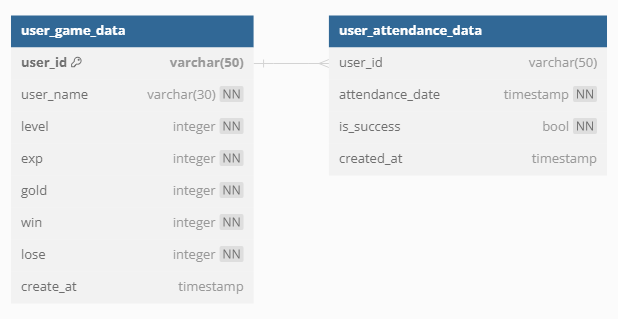

# API Server

- 아직 수정중임을 미리 밝힙니다.

## 목차
1. [설명](#설명)
2. [서버 기능](#서버-기능)
3. [주요 기능 구현](#주요-기능-구현)
4. [기존 방식과의 비교](#기존-방식과의-비교)

## 설명
- Game API 서버로써, ASP.NET Core 8로 제작되었습니다.
- Redis의 SendNX 기능을 사용하여, 유저당 하나의 요청만 처리하도록 구현하였습니다.
[SendNX 코드](./Middleware/RequestOneCheckMiddleware.cs)

## 서버 기능
### 유저 관련
|     **기능**     | **완료 여부** |
| :--------------: | :-----------: |
|   로그인 체크    |     완료      |
|   유저  로그인   |     완료      |
| 게임 데이터 로드 |     완료      |
|  유저 로그 아웃  |               |
|    매칭 기능     |     완료      |

### 메일 기능
|     **기능**     | **완료 여부** |
| :--------------: | :-----------: |
|    메일 전송     |     완료      |
|  메일 전체 읽기  |     완료      |
|    메일 삭제     |               |
| 메일 아이템 기능 |               |
|    메일 수령     |               |

### 출석 기능
|        **기능**        | **완료 여부** |
| :--------------------: | :-----------: |
|       출석 체크        |     완료      |
| 출석 체크 후 메일 전송 |     완료      |
|     출석 정보 조회     |     완료      |

### ERD

## 주요 기능 구현
### 로그인 인증
- [**Middleware**](./Middleware/TokenCheckMiddleware.cs)를 통해, 해당 유저가 로그인한 유저인지를 체크하는 기능을 구현.
- 로그인을 하게 되면 해당 유저의 ID를 Key로, 발급된 Token을 Value로 레디스에 저장함.
- 로그인 요청을 제외한 요청들에 한해서 요청 헤더에 있는 ID와 Token을, 레디스에 저장된 정보를 비교하여 인증 구현.

## 기존 방식과의 비교
- [스마일게이트 리캠프](https://github.com/sgdevcamp2023/remember/tree/main/src/backend/user-service)에서 만든 유저 서버와 비교한 내용
- **리캠프**에서는 완전 기초를 공부하기 위해 Databaes, Logger등을 직접 구현하였기 때문에 비교 X
### Controller
- **서버 캠퍼스**
  - 하나의 컨트롤러가 하나의 요청을 담당하도록 함.
  - 로그인, 로그아웃 등을 각각 하나의 컨트롤러로 구현
- **리캠프**
  - 하나의 기능에 대한 요청들을 하나의 컨트롤러가 담당하도록 함
  - 로그인, 로그아웃, 회원가입 등을 하나의 컨트롤러로 구현

- 두 가지 방식 모두 장단점을 가진다고 생각함.
  - 캠퍼스의 경우, 하나의 컨트롤러에 하나의 요청만 처리하기 때문에 컨트롤러의 코드가 길어지지 않아 유지보수에 좋다고 생각함. 
  - 다만, 요청이 많아질 수록 파일의 갯수가 많아진다는 단점이 존재.
  - 리캠프의 경우, 반대로 컨트롤러 코드의 유지보수에는 불리할 수 있으나, 기능별로 컨트롤러가 존재하기 때문에 분리되어 있다는 것이 좋다고 생각됨.
### Error
- **서버 캠퍼스**
  - 에러가 발생하는 지점에서 바로 바로 에러 처리를 진행
  
- **리캠프**
  - 에러를 하나로 처리하기 위해 에러 발생하는 지점에서 Exception을 던지도록 함.
  - 이를 Exception Middleware에서 받아서 처리하도록 구현함.
  - 단점 : Exception이 발생하는 과정에서 생기는 오버헤드.
  - 장점 : 한번에 모아서 에러를 처리할 수 있다.

### Logging
- **서버 캠퍼스**
  - Controller에서만 로그를 기록, 이 외에는 에러가 발생할 때 마다 기록
  
- **리캠프**
  - AOP 라이브러리인 `Castle.Core`를 통해 Controller - Service - Repository 을 들어갈 때 마다 로그를 기록

### 결론
- 항상 공부하면서 맞게 개발하고 있는지 궁금한 부분이 많았었는데, 궁금증을 해결할 수 있었음.
- 혼자서 공부했을 때 사용했던 방법이랑 다른 부분도 많았었지만, 맞는 부분도 있었음. 
- 서버캠퍼스에서 배운 내용들을 잘 소화한다면 더욱 좋은 API 서버를 개발할 수 있을 것.