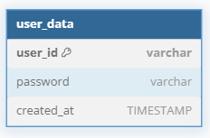

# Hive Server

## 설명
- 컴투스의 하이브 플랫폼처럼, 유저 정보를 공통으로 관리하는 서버입니다.

| 종류          | 라이브러리                  |
| ------------- | --------------------------- |
| **Framework** | `ASP.NET Core 8`            |
| **Database**  | `MySqlConnector`, `SqlKata` |
| **Redis**     | `CloudStructures`           |
| **Logger**    | `ZLogger`                   |

## 서버 기능
|    **기능**    | **완료 여부** |
| :------------: | :-----------: |
|  로그인 체크   |     완료      |
| 유저 회원가입  |     완료      |
|  유저  로그인  |     완료      |
| 유저 로그 아웃 |               |
| 유저 계정 삭제 |               |

## ERD
