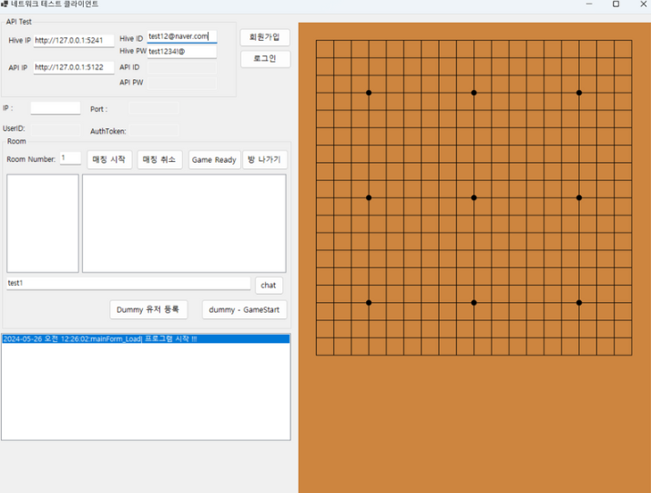

# Omok Client

## 설명
- 오목 클라이언트입니다.
- 기존의 코드를 수정하여 제작하였습니다.

## 서버 기능
### 유저 기능
|    **기능**    | **완료 여부** |
| :------------: | :-----------: |
|   서버 접속    |     완료      |
|  유저 로그인   |     완료      |
| 유저 로그 아웃 |               |

### 게임 기능
|    **기능**    | **완료 여부** |
| :------------: | :-----------: |
|    방 입장     |     완료      |
|    방 채팅     |     완료      |
|   게임 시작    |     완료      |
|    돌 두기     |     완료      |
| 오목 로직 기능 |     완료      |
|   매칭 입장    |     완료      |
|   매칭 취소    |     완료      |
|   매칭 체크    |     완료      |
|   게임 종료    |     완료      |
|   하트 비트    |     완료      |