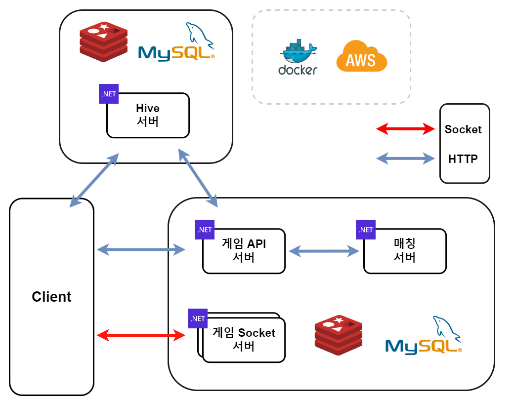

# Com2us_Project 소개
- 컴투스 서버 캠퍼스 2기 프로젝트입니다.
- 온라인 오목 게임을 제작하였습니다.

## 목표
- 캠퍼스 실장님의 지식을 최대한 많이 배워서 프로젝트에 적용하기
- 내가 가진 지식과, 현업에서의 지식 적응 차이를 비교하며 프로젝트 진행

## 설명
- 개발 기간 : 2024.04.08 ~ 2024.05.23 (7주)
  
## 전체 아키텍처

### 기술 스택
- **Language**
  - C# ASP.NET Core 8
- **Database**
  - MySQL
  - Redis
- **Common**
  - Docker
  - AWS
- **Library**
  - SqlKata (MYSQL)
  - CloudStructures (Redis)
  - SuperSocketLite (Socket)
  - MemoryPack 

# 폴더 설명

## Hive Server
- ASP.NET Core 8버전으로 제작된 API 서버입니다.
- 유저 정보를 총괄하는 서버입니다.
- 회원가입, 로그인 등 유저의 정보를 저장하는 기능을 하고 있습니다.
- [하이브 서버 폴더](./HiveServer/)

## API Server
- ASP.NET Core 8버전으로 제작된 API 서버입니다.
- 게임 API 서버로써, 오목 게임의 API 기능을 담당하는 서버입니다.
- [게임 API 서버 폴더](./APIServer/)

## MatchMaking Server
- ASP.NET Core 8버전으로 제작된 API 서버입니다.
- 매칭용 API 서버로써, Redis의 List 기능을 활용하여 게임 Socket 서버와 매칭 성공 정보를 주고 받습니다.
- [매칭 API 서버 폴더](./MatchMackingServer/)

## Game Server
- C#으로 제작된 Socket 서버입니다.
- 오목 게임 로직을 담당하는 서버로써, 유저의 게임 플레이를 담당하는 서버입니다.
- [게임 소켓 서버 폴더](./GameServer/)

## Omok Client
- C#의 Winform으로 제작된 오목 클라이언트입니다.
- 서버 캠퍼스 실장님의 기본 오목 클라이언트 코드를 토대로 수정하여 제작하였습니다.
- [클라이언트 서버 폴더](./OmokClient/)

## Docker
- 서버들을 도커 컨테이너로 올리기 위한 compose 파일과, Dockerfile를 모아놓은 폴더입니다.
- [도커 폴더](./Docker/)

## Thirdpary
- 기타 라이브러리들을 모아놓은 폴더입니다.
- GameCommon의 경우, 클라이언트와 소켓 서버가 함께 사용하는 데이터들을 모아놓은 라이브러리입니다.
- [GameCommon 폴더](./thirdparty/GameCommon/)

## 추후 해볼것들
- 해당 내용들은 캠퍼스 실장님께서 추천해주신 내용들입니다.
### C#
- **매칭 서버**
  - 매칭 요청자 중에서 서로 비슷하 실력의 플레이어를 매칭 시키기
- **오목 게임 서버**
  - 재접속
  - 게임 아이템 사용하기
  - 관전자 허용
- **더미 테스트**
  - nGrinder 혹은 자체 더미 클라이언트로 성능, 안전 테스트 하기
- **서버 모니터링**
  - 프로메테우스 & 그라파나 모니터링
- **API 서버**
  - 서비스 중인 모바일 게임에서 구현된 기능들 구현
- **개인적으로 해볼 것**
  - C# 네트워크 라이브러리를 직접 구현하여 연동하기
### C++ 
- C#으로 만들었던 온라인 오목 게임을 거의 그대로 Socket 서버만 C++로 만든다.
- 데이터 통신은 Protocol buffer을 사용해보기
- C++ ADO를 사용하는 라이브러리이다.
  - https://github.com/jacking75/AsyncAdodb
- Boost 라이브러리를 사용하여 MySQL 프로그래밍이 가능하다.
  - https://www.boost.org/doc/libs/1_85_0/libs/mysql/doc/html/index.html 
- Boost 라이브러리를 사용하여 Redis 프로그래밍이 가능하다.
  - https://www.boost.org/doc/libs/1_85_0/libs/redis/doc/html/index.html

